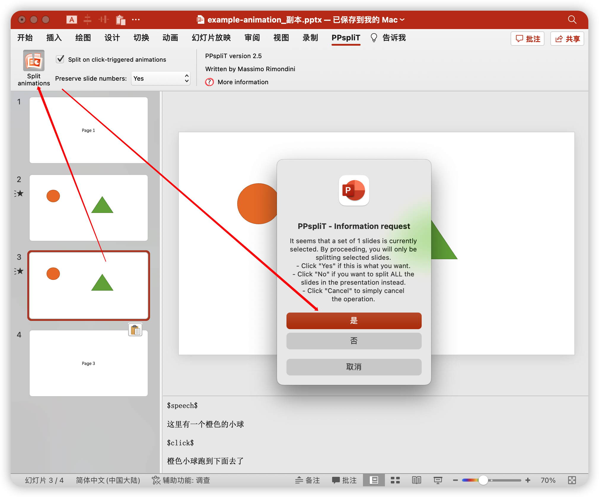

# pptx-speech

朗读 PPTX 并生成视频

## 使用方法

把 PPTX 每页的讲稿写在备注里，如 [example.pptx](doc/example.pptx) 所示


导出 PDF

- MAC: `文件` -> `导出` -> `PDF`


- Windows: TODO

把 PDF，PPTX 放到指定目录，运行脚本，得到视频 TODO

## 动画处理

如果 PPTX 包含流程图等动画，可以借助本节的方法，把动画页转为多张静态页，再进行视频转换。需要注意的是，最后的视频中只会包含动画页在每次点击后的静态图片，不会展现出页内动画效果。

如 [example-animation.pptx](doc/example-animation.pptx) 所示，其中第二页包含了动画，具体内容为左侧橙色小球落下，然后出现绿色三角形。


其中动画页的备注需要使用特殊的语法，这里先给出例子

```plaintext
$speech$

这里有一个橙色的小球

$click$

橙色小球跑到下面去了

$click$

还会出现绿色三角形
```

其中 `$speech$` 表示这是动画页，`$click$` 表示一次点击。`$click$` 基于点击对这页的讲稿进行了分割。

下载安装 [PPspliT 插件](https://github.com/maxonthegit/PPspliT)

先把动画页复制一份


选中新复制的动画页，点击 `PPspliT` -> `Split`



可以看到新的动画页被分割成了多张静态页

再隐藏原始动画页


现在即可导出 PDF，然后按照上一节的方法生成视频

以后需要修改时，只需要删除生成的静态页，修改原始动画页，然后重新分割即可。

也可以不使用本节提到的语法，而是分割动画页后在每个静态页中写讲稿，这样就不需要使用 `$speech$` 和 `$click$` 了。但是如果要修改讲稿就需要把所有静态页都修改一遍，所以不推荐这种方法。
